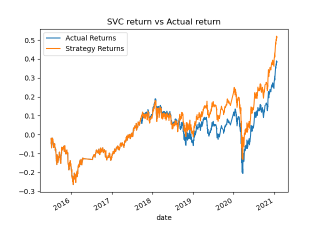
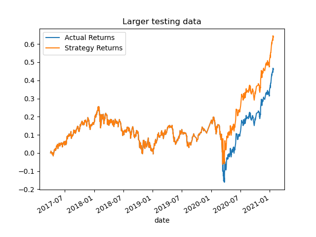
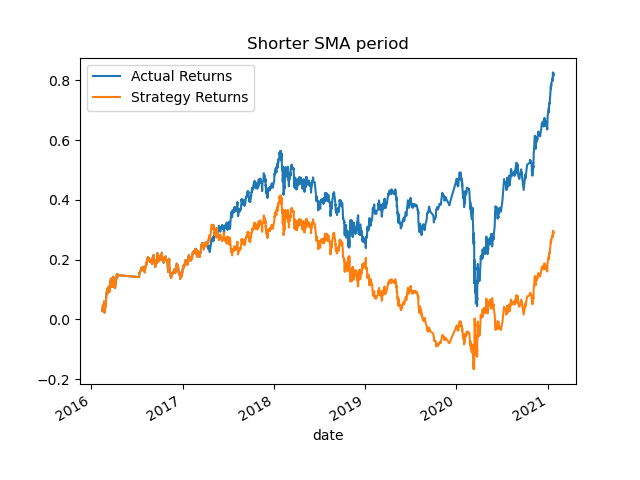
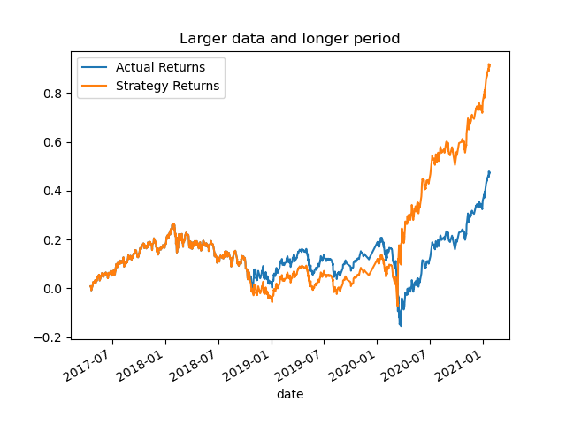
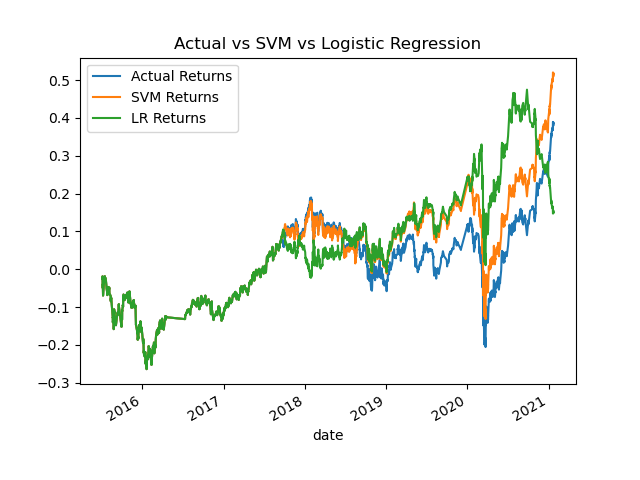

# module_14_challenge

This project is meant to identify and modify better machine learning model adjustments for a simple moving average trading strategy.

[`machine_learning_trading_bot.ipynb`](machine_learning_trading_bot.ipynb) has analysis.

# Analysis

## Original strategy - labeled as "Actual Returns"
- Training data: 3 months
- SMA Long window: 100 days
- SMA Short window: 4 days

## SVC modification
- kernel: rbf
- Total return increased about 10%

## Training data modification
- Training data: 2 years
- Total return increased about 20%

## SMA window modification
- SMA Long window: 50 days
- Total return decreased about 60%

## Modified strategy
- Training data: 2 years
- SMA Long window: 150 days
- SMA Short window: 2 days
- Total return increased about 50%

## Machine Learning model comparision
- Logistic Regression modification was performing great until middle of 2020, then lost its performance

# Conclusion

- 3 months of training data has sign of underfitting since 2 years modification has better return
- Combination of shorter short SMA window and longer long SMA window has better return

# Technology

`Python 3.7` or higher

`pathlib`, `pandas`, `numpy` and `sklearn` for data handling, encoding, and machine learning application.

`pyplot` for data visualization